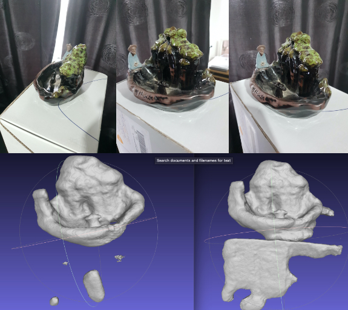
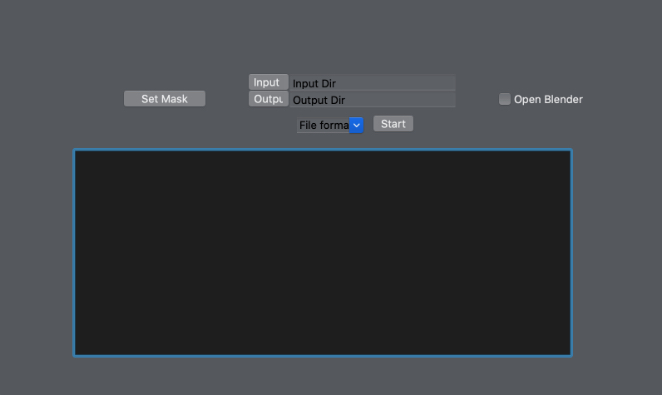

# 3D object Reconstruction

The goal of the program is takes in a set of pictures of an object and creates a 3D mesh.




---------------------------------------------
Citations
---------------------------------------------

**[1]** Moulon Pierre, Monasse Pascal, Marlet Renaud, et al. (2013). *OpenMVG: an Open Multiple View Geometry library*.

**[2]** Marí Roger (2017). *Multi-view 3D Reconstruction via Depth Map Fusion for a Smartphone Application*.

```
  @misc{mari2017depthfusion,
    author = "Roger Mar{\'i}",
    title = "Multi-view 3D Reconstruction via Depth Map Fusion for a Smartphone Application",
    year = "2017",
    howpublished = "\url{https://github.com/rogermm14/rec3D}" 
  }
```
